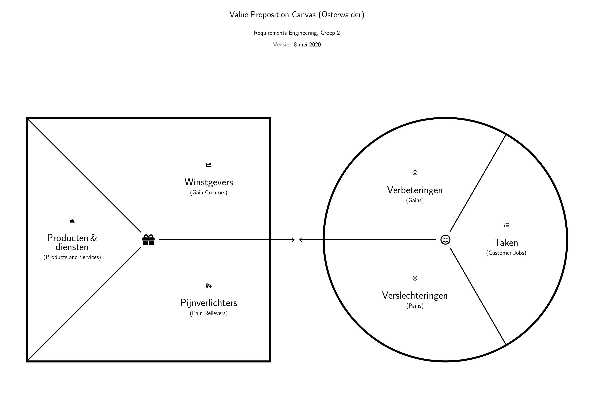

# Value Proposition Canvas (in LaTeX)
XeLaTeX-based template for Osterwalder's Value Proposition Canvas

# Requirements / Packages necessary
- fontawesome5
- tikz
- enumitem
- fontspec
- xcolor
- tikz

# Preview

